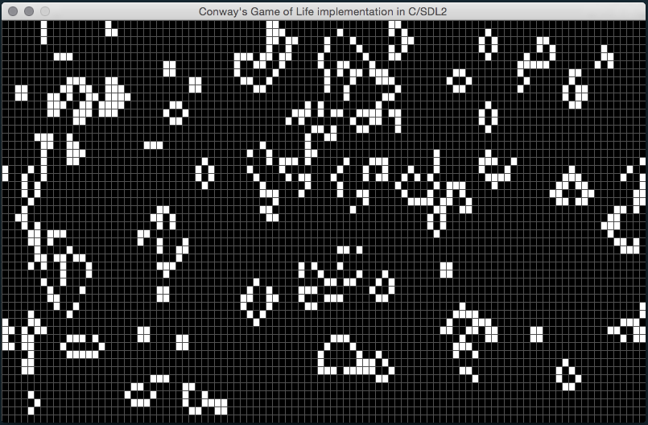
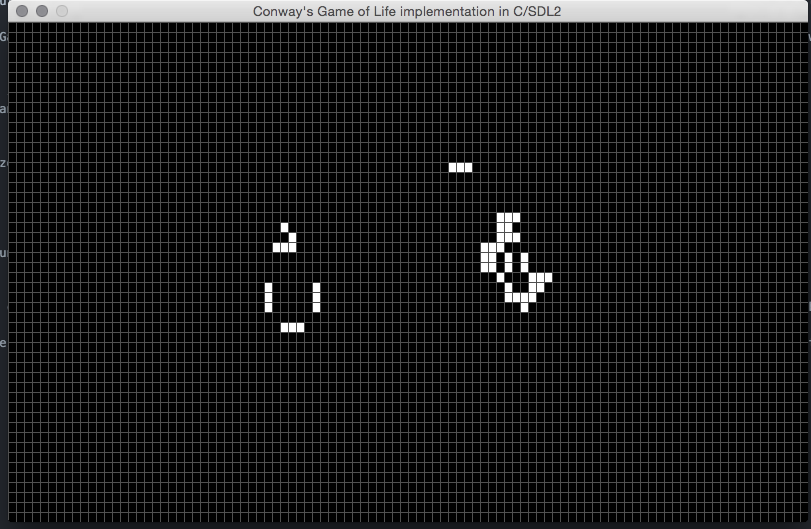

# Game-Of-Life-C
This is a simulation of a cellular automaton called John Conway's Game Of Life in C and SDL2

***Description***
John Conway's Game Of Life; or simply put, The Game Of Life, is a cellular automaton discovered by a mathematician named John Conway in 1970. It consists of a grid of cells that either live, revive, or die in further generations, depending on a set of simple rules.
<br/>
This is a simple implementation of The Game Of Life that allows you to place and remove cells, play and pause the simulation, and clear the simulation with just the press of a key, and the click of your mouse.

## Compiling
To run this example, you must have SDL2 installed, and it compiles for macOS only. (sorry)
To run the example, open your terminal and run these commands:
```
cd ProjectDirectory
git clone https://github.com/SoftwareFuze/Game-Of-Life-C.git
cd Game-Of-Life-C
make
make exec
```
Then it should open up the window and run the example.

## Usage
To start off with a blank grid, you can change the code in `main.c` where it says `initGrid(&grid);` to be `initBlankGrid(&grid);` so it initializes a blank grid instead of a randomized one.
<br/>
You start off being in placing mode, where you can click and drag to place cells. You can press `p` to start the simulation, and you can press `space` to pause the simulation at any time. You can press `c` to clear the screen and pause the simulation, and when you're done, you can press `e` to exit the simulation.

## Images


